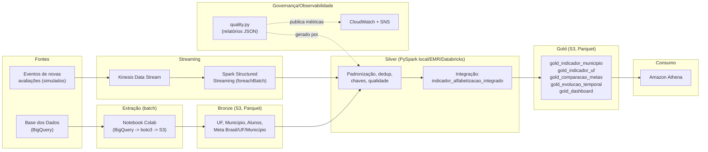

# Pipeline Híbrido para Análise da Alfabetização no Brasil

**Tech Challenge – Fase 2 | Engenharia de Dados**

Pipeline híbrida (Batch + Streaming) em AWS + Arquitetura Medalhão
(Bronze/Silver/Gold) para o **Indicador Criança Alfabetizada**, integrado a
metas nacionais, estaduais e municipais de alfabetização.

## 1. Contexto do problema

O **Compromisso Nacional Criança Alfabetizada** mobiliza União, estados e
municípios para que toda criança brasileira esteja alfabetizada até o fim do
2º ano do ensino fundamental. O INEP definiu, na *Pesquisa Alfabetiza Brasil*
(2023), o corte de 743 pontos no Saeb como o nível de alfabetização — dando
origem ao **Indicador Criança Alfabetizada**, com meta de universalização
até **2030**. Esta pipeline integra os dados desse indicador com metas de
todas as granularidades (Brasil/UF/Município) para viabilizar análises de
desigualdade educacional e políticas públicas baseadas em evidência.

## 2. Arquitetura real implementada



### Por que essa combinação de ferramentas

- **Extração via Colab + BigQuery**: a *Base dos Dados* expõe as tabelas via
  BigQuery; o Colab foi o caminho mais rápido para autenticar e consultar
  sem provisionar infraestrutura, gravando o resultado em Parquet no S3
  (camada Bronze). Não há transformação de negócio nessa etapa.
- **Silver em PySpark (`local[*]` para dev, EMR/Databricks/Glue em produção)**:
  o mesmo código sobe sem alteração para qualquer motor Spark gerenciado —
  decisão registrada no README original da Silver, mantida aqui porque o
  grupo não havia fechado ainda entre Glue, EMR e Databricks quando essa
  camada foi escrita.
- **Streaming via Kinesis + Structured Streaming**: a fonte de maior volume
  e granularidade (`dados_alunos`) é a candidata natural a chegar quase em
  tempo real; o job de streaming reaproveita a **mesma função de
  padronização** usada no batch (`process_alunos_microbatch`), evitando
  lógica duplicada.
- **Athena sobre S3**: consulta SQL serverless direto na camada Gold, sem
  cluster permanente — já validado por vocês com queries reais rodando
  contra `gold_dashboard`, `gold_indicador_municipio` etc.

## 3. O que cada camada faz (estado real, não genérico)

### Bronze
Script Colab (`bronze/fiap_fase_2_camada_bronze_v2.py`) extrai 6 tabelas da
Base dos Dados via BigQuery e sobe para `s3://tech-fiap-ai/bronze/`:
`UF`, `Municipio`, `Meta alfabetizacao Brasil/UF/municipio`, `Alunos`.

**Correções aplicadas nesta versão** (v2, em relação ao script original enviado):
1. Credencial AWS removida do código (usa Colab Secrets / variável de ambiente).
2. `sigla_uf` incluída nas consultas de Município, Meta por Município e
   Alunos — faltava o join trazer essa coluna do diretório de municípios da
   Base dos Dados, o que impedia qualquer agregação por UF a partir do
   município/aluno.

### Silver (`silver/`)
Já estava estruturada com jobs por entidade, testes (`pytest`) e um módulo de
qualidade próprio. Ajustes feitos para bater com o **schema real** do Bronze
(que usa `taxa_alfabetizacao` + colunas largas `meta_alfabetizacao_2024`
a `_2030`, não um único par `meta`/`resultado` genérico):

- `config.py`: `ENTITY_CONFIGS` reescrito com os nomes de coluna reais.
- `standardize.py`: nova função `resolve_meta_for_ano`, que resolve, por
  linha, qual das colunas largas de meta corresponde ao próprio ano da linha
  (`meta_alfabetizacao_2024` quando `ano=2024`, etc.), produzindo uma coluna
  `meta_alfabetizacao` única — necessária para comparar meta x resultado do
  mesmo ano na integração.
- `silver_dimensoes.py`: `UF.parquet`/`Municipio.parquet` reais são tabelas
  de proficiência SAEB (ano/série/rede + métricas), não dimensões simples —
  os jobs agora extraem só as colunas de identidade (`sigla_uf`/`nome_uf`,
  `id_municipio`/`nome_municipio`/`sigla_uf`) via `distinct()` para servirem
  de dimensão, mantendo a tabela Silver completa (com as métricas) para
  quem precisar do detalhe de proficiência.
- `silver_integration.py`: removida a dependência de uma coluna `regiao`
  que não existe na fonte real; resolvida uma colisão de nomes de coluna
  entre a tabela de meta municipal (que já traz `nome_municipio`/`sigla_uf`)
  e a dimensão município no join.

Testado localmente ponta a ponta (PySpark local, dados sintéticos com o
schema real) — pipeline roda sem erros e produz `atingiu_meta_municipio`
corretamente.

### Gold (`gold/`)
Construída do zero em cima da tabela `indicador_alfabetizacao_integrado`
que a Silver já gera. Cinco tabelas, cobrindo os exemplos citados no
desafio:

| Tabela | Conteúdo |
|---|---|
| `gold_indicador_municipio` | Indicador por município/ano, com meta e flag `atingiu_meta_municipio` |
| `gold_indicador_uf` | Indicador oficial por UF/ano (vindo direto da Base dos Dados, não reagregado do município, para evitar viés de municípios sem meta) + gap vs. meta estadual |
| `gold_comparacao_metas` | Município x UF x Brasil lado a lado — meta e resultado das 3 granularidades numa linha só |
| `gold_evolucao_temporal` | Série nacional por ano (média municipal + resultado/meta oficiais do Brasil) |
| `gold_dashboard` | Tabela larga, pronta para BI/Athena sem joins adicionais |

Testado localmente contra a saída real do teste da Silver — todas as 5
tabelas validadas.

### Streaming (`streaming/`)
- `kinesis_producer_simulator.py`: gera eventos sintéticos de novas provas
  de alunos e publica no Kinesis.
- `run_silver_streaming.py`: Spark Structured Streaming, lê do Kinesis e
  chama `process_alunos_microbatch` (mesma função do batch) via
  `foreachBatch`, gravando em append na Silver particionada por
  `ano, sigla_uf`.

### Monitoramento (`monitoring/`)
- `publish_quality_metrics.py`: lê os relatórios JSON que a Silver já grava
  em `data/silver/_quality_reports/` (um por entidade, a cada execução) e
  publica métricas customizadas no CloudWatch (`QualityCheckAlerts`,
  `PipelineRunStatus`) — sem duplicar a lógica de qualidade já existente.
- `setup_cloudwatch_alarms.py`: provisiona alarmes (qualidade com alerta,
  muitos alertas acumulados) com notificação via SNS por e-mail.

## 4. Regras de qualidade de dados

Implementadas em `silver/src/utils/quality.py` (já existente no projeto):
duplicidade, valores ausentes, chave de relacionamento (FK), consistência
de percentual (0–100), consistência de ano e validade de sigla de UF. Cada
execução gera um relatório JSON por entidade, com status `OK`/`ALERTA` por
regra — usado tanto para decidir se o job falha (`fail_on_alert`) quanto
como insumo do monitoramento.

## 5. Decisões arquiteturais (trade-offs)

**Batch vs. streaming**: metas e dimensões são naturalmente batch (mudam em
ciclos anuais/censitários); a fonte de alunos é a única com potencial real
de chegar quase em tempo real (novas avaliações sendo lançadas). Por isso
só `dados_alunos` tem caminho de streaming — replicar isso para as demais
fontes adicionaria complexidade sem ganho real de atualidade.

**Athena/data lake vs. data warehouse dedicado**: o volume do desafio não
justifica um cluster/Redshift sempre ligado; Parquet particionado + Athena
cobre consulta SQL sob demanda a custo zero quando ocioso, e já está em uso
por vocês.

**Gold por UF não reagregado do município**: `gold_indicador_uf` usa o
indicador oficial de UF vindo da própria Base dos Dados, em vez de calcular
a média dos municípios, porque nem todo município tem meta/indicador
cadastrado no mesmo ano — reagregar introduziria viés de amostragem.

## 6. FinOps

- **Parquet particionado por `ano`** (e por `ano, sigla_uf` em `dados_alunos`)
  em todas as camadas, reduzindo o volume escaneado pelo Athena.
- **Silver dimensional enxuta**: `uf`/`municipio` extraem só as colunas de
  identidade para uso como dimensão (join/validação), evitando replicar
  métricas de proficiência em todo join.
- **Streaming sob demanda**: o job de streaming só processa `dados_alunos`
  (a fonte que realmente precisa de baixa latência); as demais permanecem
  batch, evitando o custo de um cluster de streaming rodando 24/7 para
  dados que mudam poucas vezes por ano.
- **Monitoramento reaproveitado**: métricas do CloudWatch são derivadas dos
  relatórios de qualidade que a Silver já gera — sem processamento extra.

## 7. Aplicação em IA

- **Predição de risco de não atingir a meta**: `gold_indicador_municipio` já
  traz features prontas (resultado atual, meta, gap) por município/ano para
  um classificador binário (`atingiu_meta_municipio`).
- **Desigualdade educacional**: `gold_comparacao_metas` permite comparar o
  gap de cada município contra a média nacional, servindo de base para
  clusterização de vulnerabilidade educacional (combinando com fontes
  externas como IBGE/Atlas do Desenvolvimento Humano).
- **Séries temporais para política pública**: `gold_evolucao_temporal`
  alimenta projeções de quando o Brasil atinge a meta de 2030 no ritmo atual.

## 8. Estrutura do repositório

```
iast-pipeline/
├── README.md
├── bronze/
│   └── fiap_fase_2_camada_bronze_v2.py   # extração Colab -> BigQuery -> S3 (corrigida)
├── silver/
│   ├── README.md                          # decisões específicas da Silver
│   ├── requirements.txt
│   ├── src/
│   │   ├── config.py                      # schema real, paths, listas de referência
│   │   ├── main.py
│   │   ├── jobs/                          # dimensoes, metas, alunos, integration
│   │   └── utils/                         # standardize, quality, logging
│   └── tests/
├── gold/
│   └── src/
│       ├── config.py
│       ├── main.py
│       └── jobs/build_gold.py
├── streaming/
│   ├── kinesis_producer_simulator.py
│   └── run_silver_streaming.py
└── monitoring/
    ├── publish_quality_metrics.py
    └── setup_cloudwatch_alarms.py
```

## 9. Como rodar

```bash
# 1. Bronze (Colab) — sobe fiap_fase_2_camada_bronze_v2.py e rode lá,
#    com AWS_ACCESS_KEY_ID/AWS_SECRET_ACCESS_KEY cadastrados como Secrets.

# 2. Silver (local, lendo/escrevendo em S3 via s3a)
cd silver && pip install -r requirements.txt
aws configure   # ou export AWS_ACCESS_KEY_ID / AWS_SECRET_ACCESS_KEY
cd src && python main.py --local

# 3. Gold
cd ../../gold/src && python main.py --local

# 4. Streaming (opcional, demonstração)
python ../../streaming/kinesis_producer_simulator.py --n-events 30

# 5. Monitoramento (após ao menos uma execução da Silver)
python ../../monitoring/setup_cloudwatch_alarms.py --email seu-email@exemplo.com
python ../../monitoring/publish_quality_metrics.py --reports-dir ../silver/data/silver/_quality_reports
```

## 10. Uso de Git

Branches por funcionalidade (`feature/silver-schema-fix`,
`feature/gold-layer`, `feature/streaming`, `feature/monitoring`), commits
descritivos, PRs para `main`/`develop` com a motivação de cada decisão
(ex.: por que UF não é reagregada do município na Gold).

---

*Tech Challenge – Fase 2. Fonte: Indicador Criança Alfabetizada — Base dos
Dados / INEP.*
